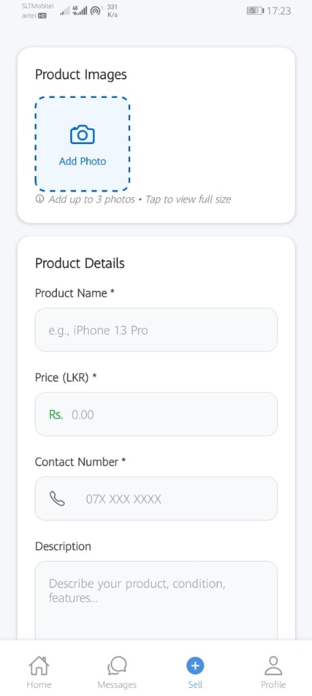
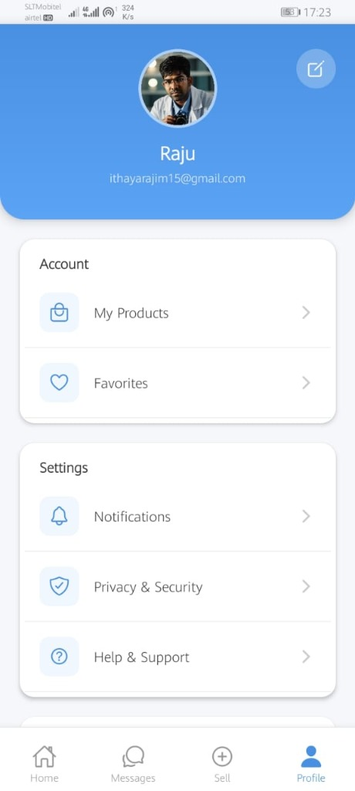

# 🎓 UniMart: University Marketplace Application

UniMart is a dedicated campus marketplace application designed for university students to buy, sell, and trade items within their community. Built with **React Native** and **Expo**, it provides a seamless and secure platform for students to find everything from textbooks and electronics to bicycles and more.

---

## 📸 App Showcase

| Home / Discovery | Sell Product |
|:---:|:---:|
|  |  |
| **Messaging System** | **User Profile** |
|  |  |

---

## ✨ Key Features

- **🛍️ Student Marketplace**: A tailored platform exclusively for university students to list and browse products.
- **📝 Easy Listing**: Simple form-based interface to add products with multiple images, detailed descriptions, and pricing in LKR.
- **💬 Real-time Messaging**: Built-in chat system for buyers and sellers to negotiate and coordinate meetups.
- **👤 Personalized Profile**: Manage your own listings, track favorite items, and customize account settings.
- **🔍 Smart Search**: Easily find what you need using the search and discovery features.
- **🛡️ Secure Backend**: Powered by Firebase for robust authentication, data storage, and image hosting.

---

## 🛠️ Tech Stack

- **Framework**: [React Native](https://reactnative.dev/) with [Expo](https://expo.dev/)
- **Navigation**: [React Navigation](https://reactnavigation.org/) (Bottom Tabs & Native Stack)
- **Backend/Database**: [Firebase](https://firebase.google.com/) (Firestore, Storage, Authentication)
- **UI Components**: Custom components with `expo-linear-gradient` for premium aesthetics.
- **Images**: `expo-image-picker` for capturing and selecting product photos.

---

## 🚀 Getting Started

### Prerequisites

- Node.js (LTS version recommended)
- Expo Go app on your mobile device (or an Android/iOS emulator)
- [Firebase account](https://console.firebase.google.com/)

### Installation

1. **Clone the repository**:
   ```bash
   git clone https://github.com/Ithayaraj/UniMart.git
   cd university_market_place
   ```

2. **Install dependencies**:
   ```bash
   npm install
   ```

3. **Configure Firebase**:
   Create a `src/firebaseConfig.js` file and add your Firebase credentials (refer to `FIREBASE_SETUP_GUIDE.md` for details).

4. **Start the application**:
   ```bash
   npx expo start
   ```

5. **Scan the QR Code**:
   Use the Expo Go app to scan the QR code displayed in your terminal.

---

## 📂 Project Structure

- `src/screens`: Contains all the main views (Home, Sell, Messages, Profile).
- `src/components`: Reusable UI elements.
- `src/context`: State management (e.g., Auth, Cart).
- `src/navigation`: App routing configuration.
- `assets/`: App icons, splash screens, and screenshots.

---

## 📄 License

Distributed under the MIT License. See `LICENSE` for more information.

---

**Developed with ❤️ for the University Community.**
